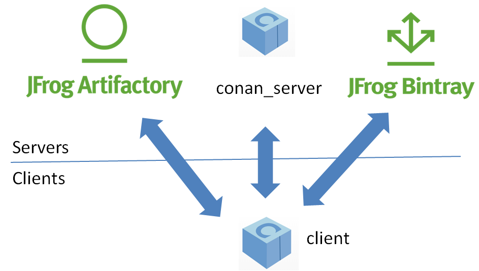

# conan

## conan介绍

[Conan](https://docs.conan.io/en/latest/introduction.html)是一个可以帮C/C++进行依赖管理的包管理器。它是免费、开源、跨平台的。目前支持Windows, Linux, OSX, FreeBSD, Solaris等平台。同时也支持嵌入式、移动端（IOS，Andriod）、或者直接基于裸机之上的目标程序开发。它当前支持各种构件系统，例如CMake，Visual Studio（MSBuild），Makefiles，Scons等等。

Conan是分布式的，它允许运行自己私有的包管理器托管自己私有的包和二进制文件。Conan是基于二进制管理的，它可以为包生成各种不同配置、不同体系架构或者编译器版本的二进制文件。

Conan相对比较成熟和稳定，有一个全职团队在维护它。Conan保证前向兼容，社区相对成熟，从开源到商业公司都有使用。它有一个官方的中央仓 [ConanCenter](https://conan.io/center/)。

Conan的源码遵循 MIT license，位于[github : https://github.com/conan-io/conan](https://github.com/conan-io/conan)。

### 分布式的包管理器

Conan是分布式的，遵循C/S架构。客户端可以从不同的远端server上获取或上传包。和git的`git pull`和`git push`类似。

Conan的服务端主要负责包的存储，并不构建和产生包。包产生于Conan的客户端，包括包中的二进制也是在客户端编译而成。



上图描述了conan的主要组成：

- Conan Client：Conan的客户端。它是一个基于命令行的程序，支持包的创建和使用。Conan客户端有一个包的本地缓存，因此你可以完全离线的创建和测试和使用本地的包。

- JFrog Artifactory Community Edition (CE)：[JFrog Artifactory Community Edition (CE)](https://conan.io/downloads.html)是官方推荐的用于私有部署的Conan服务器程序。这个是JFrog Artifactory的免费社区版，包含了WebUI、LDAP协议、拓扑管理、REST API以及能够存储构建物的通用仓库。

- Conan Server：这是一个与Conan Client一起发布的小的服务端程序。它是一个Conan服务端的开源实现，只包含服务端的基本功能，没有WebUI以及其它高级功能。

- [ConanCenter](https://conan.io/center/)：这是官方的中央仓，用于管理社区贡献的各种流行开源库，例如Boost，Zlib，OpenSSL，Poco等。

### 二进制管理

Conan最强大的特性使他能为任何可能的平台和配置生成和管理预编译的二级制文件。使用预编译的二进制文件可以避免用户反复的从源码进行构建，节省大量的开发以及持续集成服务器用于构建的时间，同时也提高了交付件的可重现性和可跟踪性。

Conan中的包由一个"conanfile.py"定义。该文件定义了包的依赖、包含的源码、以及如何从源码构建出二进制文件。一个包的"conanfile.py"配置可以生成任意数量的二进制文件，每个二进制可以面向不同的平台和配置（操作系统、体系结构、编译器、以及构件类型等等）。二进制的创建和上传，在所有平台上使用相同的命令，并且都是基于一套包的源码产生的。使用Conan不用为不同的操作系统提供不同的解决方案。


使用Conan从服务器安装包也很高效。只用从服务端下载所需平台和配置对应的二进制文件即可，不用下载所有的二进制。如果所有的二进制都不可用，也可以用客户端的源码重新构建包。

### 支持所有的平台，构建系统以及编译器

Conan可以工作在Windows, Linux (Ubuntu, Debian, RedHat, ArchLinux, Raspbian), OSX, FreeBSD, 以及 SunOS系统上。因为它是可移植的，其实它可以运行在所有可以运行python的平台上。它的目标是针对所有存在的平台，从裸机到桌面端、移动端、嵌入式以及交叉编译。

Conan支持当前所有的构建系统。它内建了与当前最流行的构建系统的集成，例如CMake、Visual Studio (MSBuild)、 Autotools、 Makefiles, SCons等等。Conan并不强制所有的包都是用相同的构建系统，每个包可以使用自己的构架系统，并且可以依赖于使用不同构建系统的其它包。Conan也支持与其它构建系统继承，包括一些专有的构建系统。

Conan支持管理任何编译器的任何版本，包含主流的gcc、cl.exe、clang、apple-clang、intel等，支持它们的各种配置、版本、运行时和C++标准库。Conan也支持各种客户自定义的编译器配置。

### 稳定性

从Conan1.0之后，开发团队保证Conan的前向兼容性，新的版本不破坏之前的用户配置和包构建发布。而使用老的Conan版本并不保证可以兼容新的包定义。

Conan需要Python3来运行，对Python2的支持到2020年1月1日。从Conan 1.22.0版本开始，不再保证Python2的支持。

### 社区

Conan当前被 Audi、 Continental、 Plex、 Electrolux、 Mercedes-Benz等公司以及全球数万开发者用于生产环境中。

Conan在[github](https://github.com/conan-io/conan)上拥有3.6k的星，许多客户为[ConanCenter](https://conan.io/center/)创建各种流行的开源库的包，超过1000名Conan用户在slack上的CppLang Slack#Conan频道中帮助回答问题。

## conan安装

-  通过pip安装（官方推荐）

需要Python版本大于等于3.5。Python 3.4以及Python2的支持将被废弃。新的Python都会预装pip，所以应该可以直接运行pip。

```sh
pip install conan
```

如果你的机器同时有python2和python3，可能需要运行：

```sh
pip3 install conan
```

- OSX安装

MAC上可以使用brew直接安装：

```sh
brew update
brew install conan
```

- 二进制安装

也可以从conan官网上直接下载二进制安装：https://conan.io/downloads.html

- 源码安装

确保你预装了python和pip。

```sh
git clone https://github.com/conan-io/conan.git
cd conan
pip install -r conans/requirements.txt
```

创建一个脚本，将其加入你的path路径中：

```sh
#!/usr/bin/env python

import sys

conan_repo_path = "/home/your_user/conan" # ABSOLUTE PATH TO CONAN REPOSITORY FOLDER

sys.path.append(conan_repo_path)
from conans.client.command import main
main(sys.argv[1:])
```

- 测试conan安装OK：

```sh
$ conan
```

打印类似如下，说明安装OK

```sh
Consumer commands
  install    Installs the requirements specified in a recipe (conanfile.py or conanfile.txt).
  config     Manages Conan configuration.
  get        Gets a file or list a directory of a given reference or package.
  info       Gets information about the dependency graph of a recipe.
  ...
```

- 升级

最简单的方式：

```sh
$ pip install conan --upgrade
```

## Quick Start

以开发一个“MD5计算器”程序为例，它使用了一个非常流行的C++的网络库[Poco](https://pocoproject.org/)。

这个例子使用CMake作为构建工具，也可以使用别的构建工具。

这个例子的源码在github上，所以你可以直接把代码clone下来，不用自己手动敲代码。

```sh
$ git clone https://github.com/conan-io/examples.git && cd examples/libraries/poco/md5
```

[https://github.com/conan-io/examples.git](https://github.com/conan-io/examples.git)仓库里面有conan各种用法的例子，建议clone下来系统的学习一下。

继续回到本例，按照以下步骤执行。

### 运行示例

- 首先创建一个目录，在里面创建一个`md5.cpp`文件，包含以下内容：

```cpp
// md5.cpp

#include "Poco/MD5Engine.h"
#include "Poco/DigestStream.h"

#include <iostream>


int main(int argc, char** argv)
{
    Poco::MD5Engine md5;
    Poco::DigestOutputStream ds(md5);
    ds << "abcdefghijklmnopqrstuvwxyz";
    ds.close();
    std::cout << Poco::DigestEngine::digestToHex(md5.digest()) << std::endl;
    return 0;
}
```

- 我们知道这个程序依赖Poco库，所以先让conan从ConanCenter中查找阿和库。

```sh
$ conan search poco --remote=conan-center
Existing package recipes:

poco/1.8.1
poco/1.9.3
poco/1.9.4
poco/1.10.0
poco/1.10.1
```

这里需要指定`--remote=conan-center`，否则conan将从本地cache中查找。

- 选择一个Poco的版本，可以查看它的包描述。

```sh
$ conan inspect poco/1.9.4
name: poco
version: 1.9.4
url: https://github.com/conan-io/conan-center-index
homepage: https://pocoproject.org
license: BSL-1.0
author: None
description: Modern, powerful open source C++ class libraries for building network- and internet-based applications that run on desktop, server, mobile and embedded systems.
topics: ('conan', 'poco', 'building', 'networking', 'server', 'mobile', 'embedded')
generators: cmake
exports: None
exports_sources: CMakeLists.txt
short_paths: False
apply_env: True
build_policy: None
revision_mode: hash
settings: ('os', 'arch', 'compiler', 'build_type')
options:
    cxx_14: [True, False]
    enable_apacheconnector: [True, False]
    enable_cppparser: [True, False]
    enable_crypto: [True, False]
    [...]
default_options:
    cxx_14: False
    enable_apacheconnector: False
    enable_cppparser: False
    enable_crypto: True
    [...]
```

从如上包描述中，也可以大致看出来conan的包的元信息能够描述的内容以及能力。

- 接下来，可以为md5程序指定依赖以及构建了。在目录下创建一个`conanfile.txt`文件，描述如下：

```toml
 [requires]
 poco/1.9.4

 [generators]
 cmake
```

这里构建指定的是cmake，所以需要提前预装cmake工具。在过程中将会产生一个`conanbuildinfo.cmake`文件，包含一些列CMake变量，指定了构建的include路径、库名称等，用于构建过程。

- 下一步，我们将要安装以来的包，以及为其产生用于构建的各种信息文件。

> 注意，如果你使用的GCC版本大于等于5.1，Conan为了后向兼容设置compile.libcxx为老的ABI，你需要使用下面的命令作以修改：
> ```sh
> $ conan profile new default --detect  # Generates default profile detecting > GCC and sets old ABI
> $ conan profile update settings.compiler.libcxx=libstdc++11 default  # Sets libcxx to C++11 ABI
> ```

执行以下命令安装依赖：

```sh
$ mkdir build && cd build
$ conan install ..
```

通过打印输出可以看到，Conan除了安装了直接依赖的Poco，还安装了间接依赖的OpenSSL和zlib库。同时它为我们的构建系统产生了conanbuildinfo.cmake文件。

- 现状，为MD5程序创建自己的构建文件。如下创建CmakeLists.txt文件，包含conan自动生成的conanbuildinfo.cmake文件。

```cmake
 cmake_minimum_required(VERSION 2.8.12)
 project(MD5Encrypter)

 add_definitions("-std=c++11")

 include(${CMAKE_BINARY_DIR}/conanbuildinfo.cmake)
 conan_basic_setup()

 add_executable(md5 md5.cpp)
 target_link_libraries(md5 ${CONAN_LIBS})
```

- 现在可以构建并运行最终的MD5计算器程序了。

```sh
$ cmake .. -G "Unix Makefiles" -DCMAKE_BUILD_TYPE=Release
$ cmake --build .
...
[100%] Built target md5
$ ./bin/md5
c3fcd3d76192e4007dfb496cca67e13b
```

### 依赖的安装

运行`conan install`命令，帮我们下载了依赖的Poco程序包，及其间接依赖的OpenSSL以及Zlib库。Conan自动根据我们的平台下载合适的二进制（Conan首次运行时会自动检测平台配置）。在这个过程中，conan会在当前目录下（示例中的build目录）创建conanbuildinfo.cmake文件，在该文件中能够看到各种CMake变量；还有一个conaninfo.txt文件，保存了各种配置、依赖和构建选项信息。

> 注意：
> Conan会自动产生根据自动检测的结果（OS、编译器、架构等等）产生默认的profile配置。这些信息会打印在`conan install`的开始。强烈建议你review下这些选项，然后根据需要进行调整。具体调整方式可以参考[这里](https://docs.conan.io/en/latest/getting_started.html#getting-started-other-configurations)。

## reference
- [homesite](https://conan.io/)
- [conancenter](https://conan.io/center/)
- [docs](https://docs.conan.io/en/latest/)
- [github/conan-io](https://github.com/conan-io/)
- [conan使用中文教程](http://blog.guorongfei.com/2018/04/23/conan-tutorial/)

